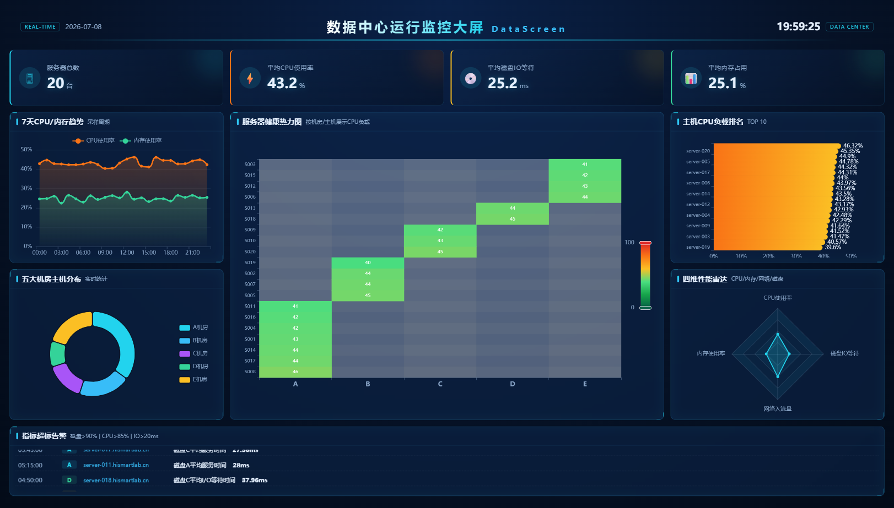

# DataScreen 数据中心运行监控大屏

>**基于 BrightScreen 明格大屏改造的全栈数据中心监控可视化项目**

DataScreen 是一个完整的数据中心运行监控大屏，包含后端 MySQL 全链路、ETL 数据处理、服务器监控数据集的业务代码，支持 Mock/DB 双数据源切换。

---

## 一、项目预览



> 上图展示 1920×1080 自适应大屏：顶部标题栏、4 组核心指标卡（服务器总数、CPU/内存/磁盘IO）、7天趋势折线、机房分布饼图、全国地图态势、主机排名柱状、四维能力雷达与底部告警滚动列表。

---

## 二、功能特性

- **全栈架构**：前端 Vue3 + ECharts + Pinia，后端 Node + Express + MySQL8.0
- **ETL 数据处理**：支持 Tab 分隔 dat 文件导入，包含时间戳转换、脏数据过滤、批量入库
- **分层数据源切换**：通过环境变量 `VITE_DATA_SOURCE` 在 `mock` / `db` 间切换，业务组件零改动
- **6 类业务接口**：机房统计、7天性能趋势、主机负载排名、磁盘 IO 延迟、四维性能雷达、指标超标告警
- **可扩展日志系统**：`src/logs/logger.ts` 提供 `info / warn / error / debug`，预留 Sentry 等线上监控接入点
- **完整质量管控**：ESLint + Prettier + Stylelint + TypeScript Strict 模式
- **双套测试体系**：Vitest 单元测试 + Playwright 端到端测试
- **自动化截图**：一行命令生成大屏预览图

---

## 三、技术栈

| 分类       | 技术                          |
| ---------- | ----------------------------- |
| 构建工具   | Vite                          |
| 核心框架   | Vue 3 + TypeScript            |
| 可视化图表 | ECharts                       |
| 状态管理   | Pinia                         |
| 请求工具   | Axios                         |
| 接口 Mock  | MSW                           |
| 后端框架   | Node + Express                |
| 数据库     | MySQL 8.0                     |
| 单元测试   | Vitest                        |
| 端到端测试 | Playwright                    |
| 质量工具   | ESLint / Prettier / Stylelint |

---

## 四、目录结构

```
BrightScreen/
├── server/                      # 后端模块（Node + Express + MySQL）
│   ├── src/
│   │   ├── config/              # 数据库配置、建表脚本
│   │   ├── etl/                 # ETL 数据导入工具
│   │   ├── routes/              # 业务路由与接口
│   │   └── index.ts             # 服务入口
│   ├── data/                    # 原始 dat 数据源文件
│   ├── package.json
│   └── tsconfig.json
├── public/                      # 静态资源
├── scripts/                     # 自动化截图脚本
├── docs/assets/                 # 文档图片
├── src/                         # 前端源码
│   ├── app/                     # 应用入口
│   ├── assets/                  # 全局样式
│   ├── components/              # 通用组件
│   ├── charts/                  # ECharts 图表封装
│   ├── views/                   # 页面视图
│   ├── layouts/                 # 大屏布局
│   ├── services/                # 业务服务层
│   ├── mocks/                   # Mock 数据与 MSW handlers
│   ├── stores/                  # Pinia 状态管理
│   ├── utils/                   # 工具函数
│   ├── logs/                    # 日志系统
│   ├── types/                   # 全局类型定义
│   └── tests/                   # 单元与端到端测试
├── index.html
├── vite.config.ts
└── package.json
```

---

## 五、快速开始

### 前端开发服务

```bash
npm install
npm run dev
```

浏览器访问 `http://127.0.0.1:5180/` 即可看到大屏。

### 后端服务（需 MySQL8.0）

```bash
cd server
npm install

# 创建数据库（MySQL）
CREATE DATABASE datascreen CHARACTER SET utf8mb4 COLLATE utf8mb4_unicode_ci;

# 修改配置（server/.env）
DB_HOST=localhost
DB_PORT=3306
DB_USER=root
DB_PASSWORD=your_password
DB_NAME=datascreen

# ETL 数据导入
npm run etl

# 启动后端服务
npm run dev
```

### 生产构建

```bash
# 前端构建
npm run build

# 后端构建
npm run server:build
```

---

## 六、双数据源切换

通过环境变量 `VITE_DATA_SOURCE` 控制数据来源：

| 模式         | 取值                    | 行为                                                    |
| ------------ | ----------------------- | ------------------------------------------------------- |
| Mock（默认） | `VITE_DATA_SOURCE=mock` | 启动 MSW 拦截请求，返回模拟数据                         |
| 真实后端     | `VITE_DATA_SOURCE=db`   | 关闭 MSW，Axios 直连 `VITE_API_BASE_URL` 指定的真实接口 |

---

## 七、数据库表结构

### host_detail（主机资产表）

| 字段 | 类型 | 说明 |
| --- | --- | --- |
| host_id | VARCHAR(64) | 主键，主机ID |
| host_name | VARCHAR(128) | 主机名称 |
| ip_addr | VARCHAR(45) | IP地址 |
| room | VARCHAR(32) | 机房标识（A/B/C/D/E） |
| rack | VARCHAR(32) | 机柜位置 |
| status | TINYINT | 状态 |

### mod_detail（指标字典表）

| 字段 | 类型 | 说明 |
| --- | --- | --- |
| mod_id | VARCHAR(32) | 主键，指标ID |
| mod_name | VARCHAR(128) | 指标名称 |
| mod_desc | VARCHAR(256) | 指标描述 |
| unit | VARCHAR(16) | 单位 |

### tsar_detail（时序采集明细表）

| 字段 | 类型 | 说明 |
| --- | --- | --- |
| id | BIGINT | 主键，自增 |
| host_id | VARCHAR(64) | 外键，关联主机 |
| mod_id | VARCHAR(32) | 外键，关联指标 |
| collect_time | DATETIME | 采集时间 |
| value | DOUBLE | 指标值 |

---

## 八、API 接口列表

| 接口 | 方法 | 说明 |
| --- | --- | --- |
| /api/dashboard | GET | 大屏聚合数据 |
| /api/dashboard/summary | GET | 服务器统计指标 |
| /api/dashboard/room-stats | GET | 机房统计 |
| /api/dashboard/trend | GET | CPU/内存趋势 |
| /api/dashboard/host-rank | GET | 主机CPU排名 |
| /api/dashboard/radar | GET | 四维性能雷达 |
| /api/dashboard/alerts | GET | 指标超标告警 |
| /api/dashboard/map | GET | 地图数据 |
| /api/health | GET | 健康检查 |

---

## 九、脚本命令一览

| 命令                 | 说明                       |
| -------------------- | -------------------------- |
| `npm run dev`        | 启动前端开发服务           |
| `npm run build`      | 前端生产打包               |
| `npm run preview`    | 预览打包产物               |
| `npm run lint`       | 全项目代码规范校验         |
| `npm run test`       | 运行单元测试               |
| `npm run test:e2e`   | 运行 Playwright 端到端测试 |
| `npm run server:dev` | 启动后端服务               |
| `npm run server:etl` | 执行 ETL 数据导入          |

---

## 十、许可证

本项目基于 [MIT 协议](./LICENSE) 开源。
